## 系统地址
---

+ 测试环境： [http://192.168.10.2:8086/Portal/PortalPageIndexStart.aspx](http://192.168.10.2:8086/Portal/PortalPageIndexStart.aspx)

+ 模块入口：`经管平台` → `预算管理` 

## 接口信息
---

### 1. 账套管理

+ ### 账套列表

    - 界面

        `经管平台` → `预算管理` → `系统管理` → `账套管理` 

    - 方法

        `GetAccounts()`

    - 输入
  
        | 参数名 | 类型 | 说明 | 必填 |
        | --- | --- | --- | --- |
        | page | number | 页码 | Y |
        | size | number | 每页条数 | Y |
        | where | string | 筛选条件 | N |
        | sortname | string | 排序字段 | N |
        | sortorder | string | 排序方式 | N |

    - 输出

        | 参数名 | 类型 | 说明 |
        | --- | --- | --- |
        | total | int | 总数 |
        | rows | array | 数据 |

        *rows定义：*

        | 参数名 | 类型 | 说明 |
        | --- | --- | --- |
        | Code | string | 编码 |
        | Name | string | 名称 |
        | StartDate | string | 开始时间 |
        | EndDate | string | 结束时间 |

    - 实现

        `MCS.XZTown.Budget.Web` / `ApiControllers` / `AccountController.cs` / `GetAccounts()` 

        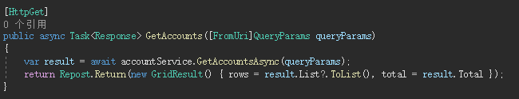

+ ### 账套保存

    - 界面

        `经管平台` → `预算管理` → `系统管理` → `账套管理` 

    - 方法

        `Save()`

    - 输入
  
        | 参数名 | 类型 | 说明 | 必填 |
        | --- | --- | --- | --- |
        | Code | string | 编码 | N |
        | Name | string | 名称 | Y |
        | StartDate | string | 开始时间 | N |
        | EndDate | string | 结束时间 | N |
        | DepCodes | string | 可申请部门编码 | N |
        | Remark | string | 描述 | N |

    - 输出

        `是否成功`

    - 实现

        `MCS.XZTown.Budget.Web` / `ApiControllers` / `AccountController.cs` / `Save()` 

        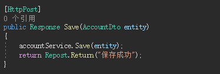

+ ### 账套编辑

    - 界面

        `经管平台` → `预算管理` → `系统管理` → `账套管理` 

    - 方法

        `Edit()`

    - 输入
  
        | 参数名 | 类型 | 说明 | 必填 |
        | --- | --- | --- | --- |
        | code | string | 编码 | Y |

    - 输出

        | 参数名 | 类型 | 说明 |
        | --- | --- | --- |
        | Code | string | 编码 |
        | Name | string | 名称 |
        | StartDate | string | 开始时间 |
        | EndDate | string | 结束时间 |
        | DepCodes | string | 可申请部门编码 |
        | DepNames | string | 可申请部门名称 |
        | Remark | string | 描述 |

    - 实现

        `MCS.XZTown.Budget.Web` / `Controllers` / `AccountController.cs` / `Edit()` 

        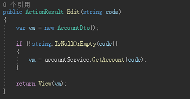

+ ### 账套删除

    - 界面位置

        `经管平台` → `预算管理` → `系统管理` → `账套管理` 

    - 方法名

        `Delete()`

    - 输入
  
        | 参数名 | 类型 | 说明 | 必填 |
        | --- | --- | --- | --- |
        | code | string | 编码 | Y |

    - 输出

        `是否成功`

    - 实现逻辑

        `MCS.XZTown.Budget.Web` / `ApiControllers` / `AccountController.cs` / `Delete()` 

        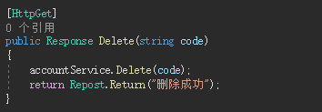

### 2. 科目管理

+ ### 科目列表

    - 界面位置

        `经管平台` → `预算管理` → `系统管理` → `科目管理` 

    - 方法名

        `GetSubjects()` 

    - 输入
  
        | 参数名 | 类型 | 说明 | 必填 |
        | --- | --- | --- | --- |
        | page | number | 页码 | Y |
        | size | number | 每页条数 | Y |
        | where | string | 筛选条件 | N |
        | sortname | string | 排序字段 | N |
        | sortorder | string | 排序方式 | N |

    - 输出

        | 参数名 | 类型 | 说明 |
        | --- | --- | --- |
        | total | int | 总数 |
        | rows | array | 数据 |

        *rows定义：*

        | 参数名 | 类型 | 说明 |
        | --- | --- | --- |
        | Code | string | 编码 |
        | Name | string | 名称 |
        | DepCode | string | 部门编码 |
        | DepName | string | 部门名称 |
        | IsUse | string | 是否启用 |
        | DownTime | string | 失效时间 |
        | Remark | string | 说明 |

    - 实现逻辑

        `MCS.XZTown.Budget.Web` / `ApiControllers` / `SubjectController.cs` / `GetSubjects()`

        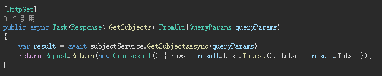

+ ### 科目保存

    - 界面位置

        `经管平台` → `预算管理` → `系统管理` → `科目管理` 

    - 方法名

        `Save()` 

    - 输入
  
        | 参数名 | 类型 | 说明 | 必填 |
        | --- | --- | --- | --- |
        | Code | string | 编码 | N |
        | Name | string | 名称 | Y |
        | DepCode | string | 部门编码 | N |
        | DepName | string | 部门名称 | N |
        | IsUse | string | 是否启用 | N |
        | DownTime | string | 失效时间 | N |
        | Remark | string | 说明 | N |

    - 输出

        `是否成功`

    - 实现逻辑

        `MCS.XZTown.Budget.Web` / `ApiControllers` / `SubjectController.cs` / `Save()`

        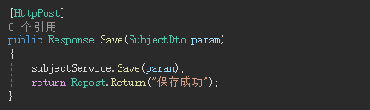

+ ### 科目编辑

    - 界面位置

        `经管平台` → `预算管理` → `系统管理` → `科目管理` 

    - 方法名

        `Edit()` 

    - 输入
  
        | 参数名 | 类型 | 说明 | 必填 |
        | --- | --- | --- | --- |
        | code | string | 编码 | Y |

    - 输出

        | 参数名 | 类型 | 说明 |
        | --- | --- | --- |
        | Code | string | 编码 |
        | Name | string | 名称 |
        | DepCode | string | 部门编码 |
        | DepName | string | 部门名称 |
        | IsUse | string | 是否启用 |
        | DownTime | string | 失效时间 |
        | Remark | string | 说明 |

    - 实现逻辑

        `MCS.XZTown.Budget.Web` / `Controllers` / `SubjectController.cs` / `Edit()`

        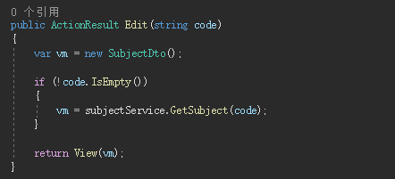

+ ### 科目删除

    - 界面位置

        `经管平台` → `预算管理` → `系统管理` → `科目管理` 

    - 方法名

        `Delete()`

    - 输入
  
        | 参数名 | 类型 | 说明 | 必填 |
        | --- | --- | --- | --- |
        | code | string | 编码 | Y |

    - 输出

       `是否成功`

    - 实现逻辑

        `MCS.XZTown.Budget.Web` / `ApiControllers` / `SubjectController.cs` / `Delete()`

        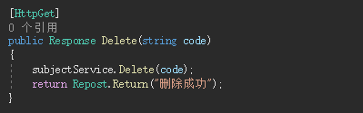

### 3. 项目管理

+ ### 项目列表

    - 界面位置

        `经管平台` → `预算管理` → `项目管理` → `项目申报` 

    - 方法名

        `GetProjects()` 

    - 输入
  
        | 参数名 | 类型 | 说明 | 必填 |
        | --- | --- | --- | --- |
        | page | number | 页码 | Y |
        | size | number | 每页条数 | Y |
        | where | string | 筛选条件 | N |
        | sortname | string | 排序字段 | N |
        | sortorder | string | 排序方式 | N |

    - 输出

        | 参数名 | 类型 | 说明 |
        | --- | --- | --- |
        | total | int | 总数 |
        | rows | array | 数据 |

        *rows定义：*

        | 参数名 | 类型 | 说明 |
        | --- | --- | --- |
        | Code | string | 编码 |
        | Name | string | 名称 |
        | DepCode | string | 部门编码 |
        | DepName | string | 部门名称 |
        | Type | string | 类型： `OneOff` 一次性项目；  `Recurrent` 经常性项目；|
        | Amount | string | 总金额 |
        | Leader | string | 负责人 |
        | Contact | string | 联系人 |
        | Phone | string | 联系电话 |
        | StartDate | string | 开始日期 |
        | EndDate | string | 结束日期 |
        | IsGovernmentPurchase | boolen | 是否政府采购 |
        | Overview | string | 项目概况 |
        | ResourceAndInstitution | string | 资源投入和制度建设 |
        | Goals | string | 总目标 |
        | Remark | string | 备注 |
        | Status | string | 状态： `Default` 草稿；  `WaitReport` 待预算上报；  `WaitApprove` 待领导审批；  `WaitArrange` 待安排；  `Arranged` 已发布；  `Over` 已结束；|
        | ProcurementMethod | string | 采购方式：  `OpenTendering` 公开招标；  `SelectiveTendering` 邀请招标； |
        | IsSubmit | boolen | 是否提交 |
        | IsApproveShow | boolen | 是否审批 |
        | SubmittedAmount | number | 已报预算 |
        | CurrentAmount | string | 当前预算 |
        | TypeDescription | string | 类型描述 |
        | StatusDescription | string | 状态描述 |
        | ProcurementMethodDescription | string | 采购方式描述 |
        | TotalTime | string | 项目用时 |

    - 实现逻辑

        `MCS.XZTown.Budget.Web` / `ApiControllers` / `ProjectController.cs` / `GetProjects()`

        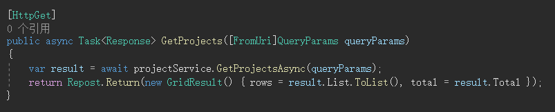

+ ### 项目保存

    - 界面

        `经管平台` → `预算管理` → `项目管理` → `项目申报` 

    - 方法

        `Save()`

    - 输入
  
        | 参数名 | 类型 | 说明 | 必填 |
        | --- | --- | --- | --- |
        | Code | string | 编码 | N |
        | Name | string | 名称 | Y |
        | Type | string | 类型： `OneOff` 一次性项目；  `Recurrent` 经常性项目；| Y |
        | ProcurementMethod | string | 采购方式：  `OpenTendering` 公开招标；  `SelectiveTendering` 邀请招标； | N |
        | Amount | string | 总金额 | Y |
        | Leader | string | 负责人 | N |
        | Contact | string | 联系人 | N |
        | Phone | string | 联系电话 | N |
        | StartDate | string | 开始日期 | N |
        | EndDate | string | 结束日期 | N |
        | IsGovernmentPurchase | boolen | 是否政府采购 | N |
        | Overview | string | 项目概况 | N |
        | ResourceAndInstitution | string | 资源投入和制度建设 | N |
        | Goals | string | 总目标 | N |
        | Remark | string | 备注 | N |
        

    - 输出

        `是否成功`

    - 实现

        `MCS.XZTown.Budget.Web` / `ApiControllers` / `ProjectController.cs` / `Save()` 

        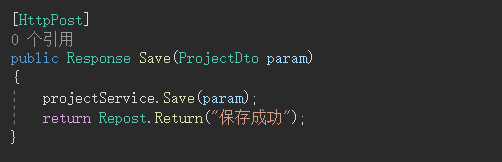

+ ### 项目编辑

    - 界面

        `经管平台` → `预算管理` → `项目管理` → `项目申报` 

    - 方法

        `Edit()`

    - 输入
  
        | 参数名 | 类型 | 说明 | 必填 |
        | --- | --- | --- | --- |
        | code | string | 编码 | Y |
        
    - 输出

        | 参数名 | 类型 | 说明 |
        | --- | --- | --- |
        | Code | string | 编码 |
        | Name | string | 名称 |
        | Type | string | 类型： `OneOff` 一次性项目；  `Recurrent` 经常性项目；|
        | ProcurementMethod | string | 采购方式：  `OpenTendering` 公开招标；  `SelectiveTendering` 邀请招标； |
        | Amount | string | 总金额 |
        | Leader | string | 负责人 |
        | Contact | string | 联系人 |
        | Phone | string | 联系电话 |
        | StartDate | string | 开始日期 |
        | EndDate | string | 结束日期 |
        | IsGovernmentPurchase | boolen | 是否政府采购 |
        | Overview | string | 项目概况 |
        | ResourceAndInstitution | string | 资源投入和制度建设 |
        | Goals | string | 总目标 |
        | Remark | string | 备注 |

    - 实现

        `MCS.XZTown.Budget.Web` / `Controllers` / `ProjectController.cs` / `Edit()` 

        

+ ### 项目删除

    - 界面

        `经管平台` → `预算管理` → `项目管理` → `项目申报` 

    - 方法

        `Delete()`

    - 输入
  
        | 参数名 | 类型 | 说明 | 必填 |
        | --- | --- | --- | --- |
        | code | string | 编码 | Y |
        
    - 输出

        `是否成功`

    - 实现

        `MCS.XZTown.Budget.Web` / `ApiControllers` / `ProjectController.cs` / `Delete()` 

        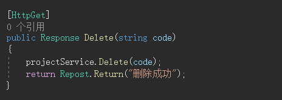

+ ### 项目查看

    - 界面

        `经管平台` → `预算管理` → `项目管理` → `项目申报` 

    - 方法

        `View()`

    - 输入
  
        | 参数名 | 类型 | 说明 | 必填 |
        | --- | --- | --- | --- |
        | code | string | 编码 | Y |
        | type | string | 类型 | N |
        
    - 输出

        | 参数名 | 类型 | 说明 |
        | --- | --- | --- |
        | Code | string | 编码 |
        | Name | string | 名称 |
        | Type | string | 类型： `OneOff` 一次性项目；  `Recurrent` 经常性项目；|
        | ProcurementMethod | string | 采购方式：  `OpenTendering` 公开招标；  `SelectiveTendering` 邀请招标； |
        | Amount | string | 总金额 |
        | Leader | string | 负责人 |
        | Contact | string | 联系人 |
        | Phone | string | 联系电话 |
        | StartDate | string | 开始日期 |
        | EndDate | string | 结束日期 |
        | IsGovernmentPurchase | boolen | 是否政府采购 |
        | Overview | string | 项目概况 |
        | ResourceAndInstitution | string | 资源投入和制度建设 |
        | Goals | string | 总目标 |
        | Remark | string | 备注 |
        | DepCode | string | 部门编码 |
        | DepName | string | 部门名称 |
        | Evaluation | object | 评价信息 |

        *Evaluation定义*
        | 参数名 | 类型 | 说明 |
        | --- | --- | --- |
        | Code | string | 编码 |
        | Result | string | 评价结果： `Excellent` 优； `Good` 良；  `Poor` 差； |
        | IsQualified | boolen | 评价结论 |
        | Notes | string | 说明 |
        | ResultDescription | string | 评价结论 |
        | LastEditor | string | 评价人 |
        | LastEditTime | string | 评价时间 |

    - 实现

        `MCS.XZTown.Budget.Web` / `Controllers` / `ProjectController.cs` / `View()` 

        

+ ### 项目审批

    - 界面

        `经管平台` → `预算管理` → `项目管理` → `项目申报` 

    - 方法

        `Approve()`

    - 输入
  
        | 参数名 | 类型 | 说明 | 必填 |
        | --- | --- | --- | --- |
        | Code | string | 编码 | Y |
        | Result | boolen | 审批结果：  `true` 同意；   `false` 不同意； | N |
        | Notes | string | 备注 | N |
        
    - 输出
    
        `是否成功`

    - 实现

        `MCS.XZTown.Budget.Web` / `ApiControllers` / `ProjectController.cs` / `Approve()` 

        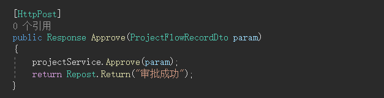

+ ### 项目审批记录

    - 界面

        `经管平台` → `预算管理` → `项目管理` → `项目申报` 

    - 方法

        `GetProjectFlowRecords()`

    - 输入
  
        | 参数名 | 类型 | 说明 | 必填 |
        | --- | --- | --- | --- |
        | where | string | 筛选条件 | Y |
        
    - 输出
    
        | 参数名 | 类型 | 说明 |
        | --- | --- | --- |
        | total | int | 总数 |
        | rows | array | 数据 |

        *rows定义：*

        | 参数名 | 类型 | 说明 |
        | --- | --- | --- |
        | ID | string | ID |
        | Code | string | 编码 |
        | Step | string | 步骤 |
        | Result | boolen | 审批结果： `true` 同意； `false` 不同意； |
        | Notes | string | 说明 |
        | Creater | string | 操作人 |
        | DepName | string | 部门 |
        | CreateTime | string | 操作时间 |
        | ResultDisplay | string | 审批结果显示 |

    - 实现

        `MCS.XZTown.Budget.Web` / `ApiControllers` / `ProjectController.cs` / `GetProjectFlowRecords()` 

        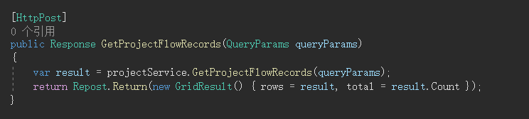

+ ### 项目评价列表

    - 界面

        `经管平台` → `预算管理` → `项目管理` → `评价管理` 

    - 方法

        `GetProjectEvaluations()`

    - 输入
  
        | 参数名 | 类型 | 说明 | 必填 |
        | --- | --- | --- | --- |
        | page | number | 页码 | Y |
        | size | number | 每页条数 | Y |
        | DepName | string | 部门名称 | N |
        | Name | string | 项目名称 | N |
        | EvaluateStatus | string | 评价状态：`1` 已评价； | N |
        
    - 输出
    
        | 参数名 | 类型 | 说明 |
        | --- | --- | --- |
        | total | int | 总数 |
        | rows | array | 数据 |

        *rows定义：*

        | 参数名 | 类型 | 说明 |
        | --- | --- | --- |
        | Code | string | 编码 |
        | Name | string | 名称 |
        | Type | string | 类型： `OneOff` 一次性项目；  `Recurrent` 经常性项目；|
        | Amount | string | 总金额 |
        | StartDate | string | 开始日期 |
        | EndDate | string | 结束日期 |
        | DepCode | string | 部门编码 |
        | DepName | string | 部门名称 |
        | Result | string | 评价结果： `Excellent` 优； `Good` 良；  `Poor` 差； |
        | IsQualified | boolen | 评价结论 |

    - 实现

        `MCS.XZTown.Budget.Web` / `ApiControllers` / `ProjectController.cs` / `GetProjectEvaluations()` 

        

+ ### 项目评价保存

    - 界面

        `经管平台` → `预算管理` → `项目管理` → `评价管理` 

    - 方法

        `SaveEvaluation()`

    - 输入
  
        | 参数名 | 类型 | 说明 | 必填 |
        | --- | --- | --- | --- |
        | ID | string | 评价ID | N |
        | Code | string | 项目编码 | Y |
        | IsQualified | boolen | 评价结论 | Y |
        | Result | string | 评价结果： `Excellent` 优； `Good` 良；  `Poor` 差； | N |
        | Notes | string | 说明 | N |
        

    - 输出

        `是否成功`

    - 实现

        `MCS.XZTown.Budget.Web` / `ApiControllers` / `ProjectController.cs` / `Save()` 

        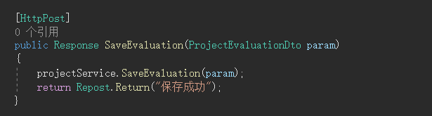

+ ### 项目评价编辑

    - 界面

        `经管平台` → `预算管理` → `项目管理` → `评价管理` 

    - 方法

        `EvaluationEdit()`

    - 输入
  
        | 参数名 | 类型 | 说明 | 必填 |
        | --- | --- | --- | --- |
        | code | string | 项目编码 | Y |
        | id | string | 评价ID | N |
        
    - 输出

        | 参数名 | 类型 | 说明 |
        | --- | --- | --- |
        | ID | string | ID |
        | Code | string | 编码 |
        | IsQualified | boolen | 评价结论 |
        | Result | string | 评价结果： `Excellent` 优； `Good` 良；  `Poor` 差； |
        | Notes | string | 说明 |

    - 实现

        `MCS.XZTown.Budget.Web` / `Controllers` / `ProjectController.cs` / `EvaluationEdit()` 

        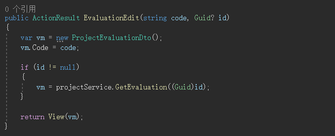

### 4. 预算管理

+ ### 预算项目列表

+ ### 预算项目详情

+ ### 预算明细列表

+ ### 预算明细保存

+ ### 预算明细删除

+ ### 支出计划列表

+ ### 支出计划保存

+ ### 支出计划删除

+ ### 年度目标列表

+ ### 年度目标保存

+ ### 相关文件列表

+ ### 相关文件保存

+ ### 相关文件删除

+ ### 预算提交

+ ### 预算审批

+ ### 预算审批记录

